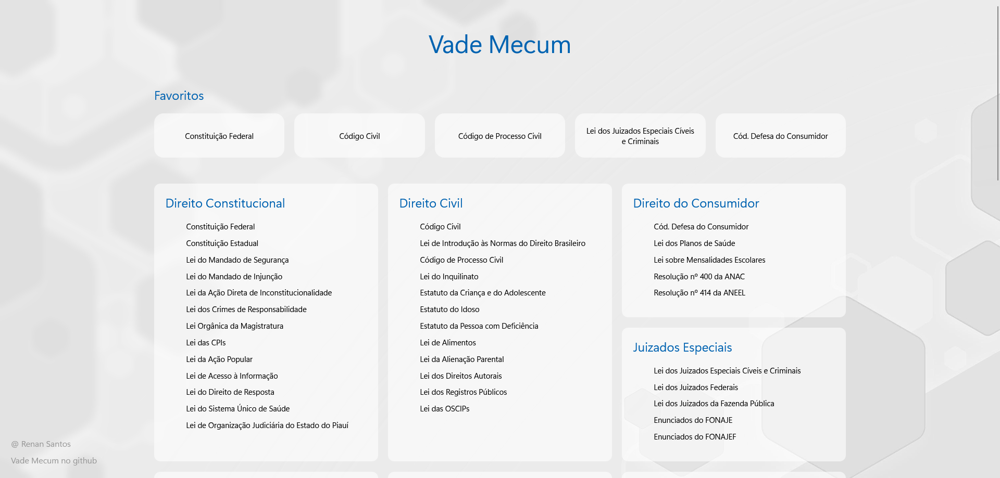
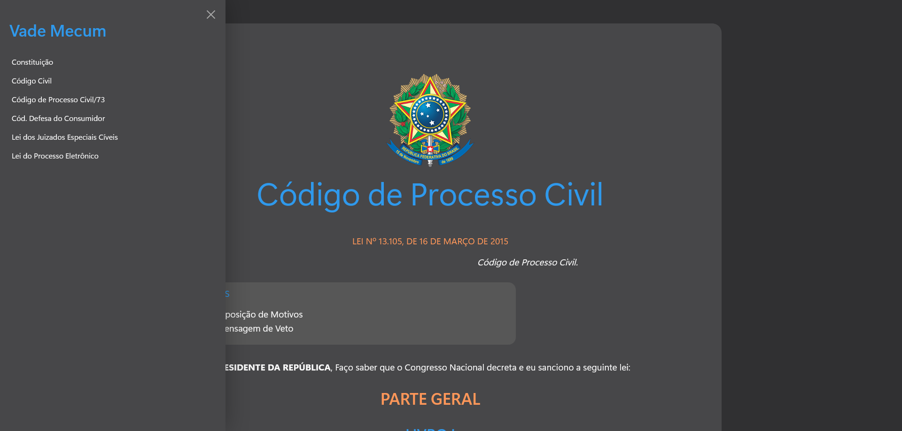

# Vade Mecum

[viste o site](https://vade-mecum.vercel.app/)

Um projeto de Vade Mecum para estudantes e profissionais de Direito, com as principais legislações brasileiras.

Possui também links para páginas de Súmulas do STF e STJ.

## Interface

Tela principal

Constituição Federal

CPC no modo escuro com menu lateral

## Funcionalidades
- Layout atual e responsivo;
- Modo escuro;
- Melhor legibilidade;
- Facilidade de uso.

## Funcionalidades pretendidas

- implementação de ações JavaScript para:
    - criação de menus laterais de navegações entre as leis; ✅
    - busca por artigo; ⌛
    - busca de leis na página inicial.
    - personalização da seção de favoritos conforme o uso;
    - fazer marcações nas leis
- conversão em app Electron.
