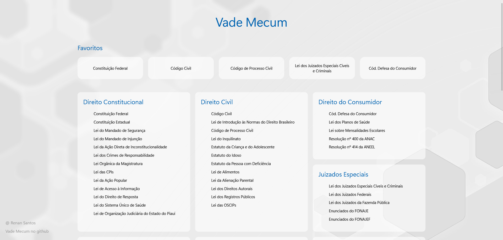
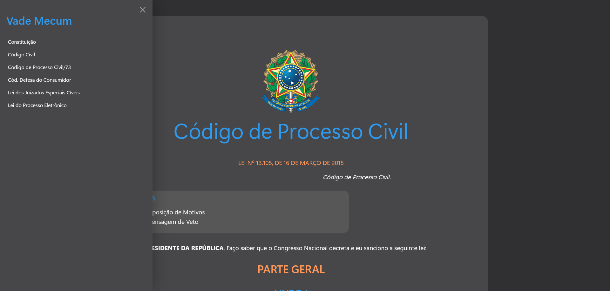

# Vade Mecum

> 📖 [Viste o site](https://vade-mecum.vercel.app/)

Um projeto de Vade Mecum para estudantes e profissionais de Direito, com as principais legislações brasileiras.

Possui também links para páginas de Súmulas do STF e STJ.

## Interface

Tela principal

Constituição Federal

CPC no modo escuro com menu lateral

## Interface mobile

Tela principal no celular

## Funcionalidades
- Layout atual e responsivo;
- Modo escuro;
- Melhor legibilidade;
- Adaptado para telas *ultrawide*
- Facilidade de uso.

## Tecnologias Usadas

- React
- TypeScript

## Licensa

Este projeto está publicado com a licensa GNU, para mais detalhes, consulte a [arquivo da Licensa](./LICENSE).