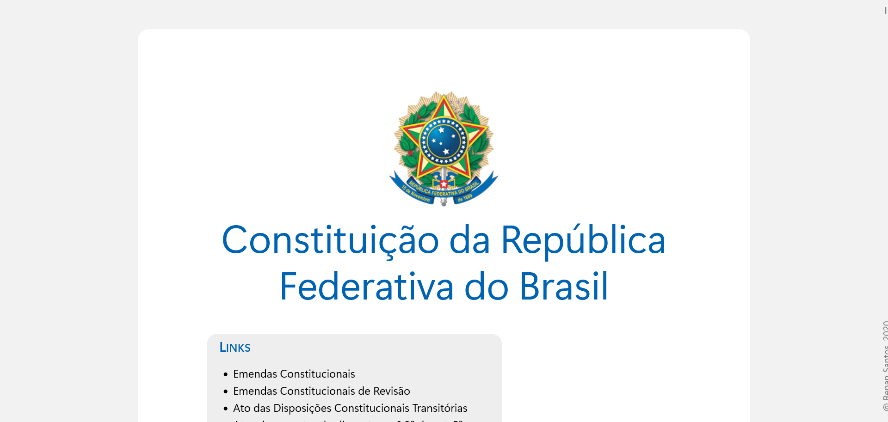

# Vade Mecum
Um projeto de Vade Mecum para estudantes e profissionais de Direito, com as principais legislações brasileiras.

Possui também links para páginas de Súmulas do STF e STJ.

## Interface

## Funcionalidades pretendidas

- implementação de ações JavaScript para criação de menus laterais;
- conversão em app Electro.
